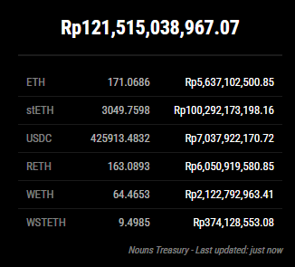
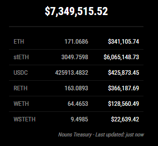

# MMM-NounsTreasury

A MagicMirror² module that displays the current value of the Nouns Treasury, including ETH and various ERC20 token balances.




## Features

- Real-time display of Nouns Treasury total value
- Shows ETH balance and value
- Displays balances and values of major tokens in the treasury:
  - stETH (Staked Ether)
  - USDC (USD Coin)
  - rETH (Rocket Pool ETH)
  - WETH (Wrapped Ether)
  - wstETH (Wrapped Staked Ether)
- Configurable update interval
- Support for USD and IDR currency display
- Option to show/hide token balances
- Rate-limited API calls to prevent throttling
- Error handling and graceful fallbacks

## Installation

1. Navigate to your MagicMirror's `modules` folder:
```bash
cd ~/MagicMirror/modules
```

2. Clone this repository:
```bash
git clone https://github.com/yourusername/MMM-NounsTreasury.git
```

3. Install the required dependencies:
```bash
cd MMM-NounsTreasury
npm install
```

## Configuration

Add the following configuration block to the `modules` array in your `config/config.js` file:

```javascript
{
    module: "MMM-NounsTreasury",
    position: "top_right", // Change this to your desired position
    config: {
        updateInterval: 300000, // Update every 5 minutes
        address: "0xb1a32FC9F9D8b2cf86C068Cae13108809547ef71", // Nouns Treasury address
        apiKey: "YOUR_ALCHEMY_API_KEY", // Your Alchemy API key
        currency: "usd", // "usd" or "idr"
        maxTokenDisplay: 10, // Maximum number of tokens to display
        showBalance: true, // Whether to show token balances
        targetTokens: [
            {
                address: "0xae7ab96520de3a18e5e111b5eaab095312d7fe84", // stETH
                coingeckoId: "staked-ether"
            },
            // ... other tokens
        ]
    }
}
```

### Configuration Options

| Option | Type | Default | Description |
|--------|------|---------|-------------|
| `updateInterval` | Number | 300000 | How often to update the data (in milliseconds) |
| `address` | String | "0xb1a32FC9F9D8b2cf86C068Cae13108809547ef71" | The Ethereum address to monitor |
| `apiKey` | String | "" | Your Alchemy API key |
| `currency` | String | "usd" | Display currency ("usd" or "idr") |
| `maxTokenDisplay` | Number | 10 | Maximum number of tokens to display |
| `showBalance` | Boolean | true | Whether to show token balances |
| `targetTokens` | Array | [...] | Array of token configurations to monitor |

## Dependencies

- `axios`: For making HTTP requests

## API Requirements

This module requires an Alchemy API key to function. You can get one by:
1. Going to [Alchemy's website](https://www.alchemy.com/)
2. Creating an account
3. Creating a new app
4. Copying your API key

## Styling

The module includes a CSS file (`MMM-NounsTreasury.css`) that provides a clean and modern look. You can customize the styling by modifying this file.

## Contributing

Feel free to submit issues and enhancement requests!

## License

MIT License - See LICENSE file for details 
